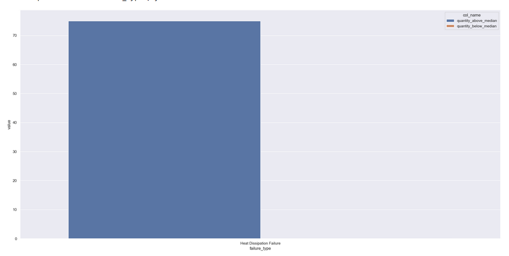
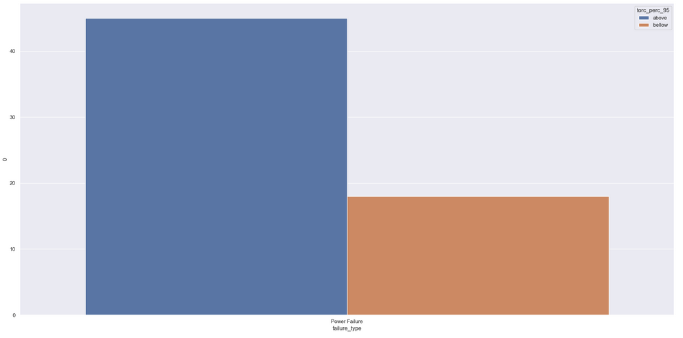

# Problema

objetivo é identificar quais máquinas apresentam potencial de falha tendo como base dados extraídos através de sensores durante o processo de manufatura.

**Dataset overview**

| **Variable** | **Meaning** |
|:----------:|---------|
UID | unique identifier ranging from 1 to 10000|
product ID | consisting of a letter L, M, or H for low (50% of all products), medium (30%) and high (20%) as product quality variants and a variant-specific serial number|
type | just the product type L, M or H from column 2|
air temperature [K] | generated using a random walk process later normalized to a standard deviation of 2 K around 300 K|
process temperature [K] | generated using a random walk process normalized to a standard deviation of 1 K, added to the air temperature plus 10 K.|
rotational speed [rpm] | calculated from a power of 2860 W, overlaid with a normally distributed noise|
torque [Nm] | torque values are normally distributed around 40 Nm with a SD = 10 Nm and no negative values.|
tool wear [min] | The quality variants H/M/L add 5/3/2 minutes of tool wear to the used tool in the process.|

##  Premissas

<ul>
<li>O dataset possui uma variável alvo "failure_type" com 6 classes no total, representando um problema de classificação multiclasse.</li>
<li>O dataset apresenta um problema de desequilíbrio de classes na variável target "failure_type", com a classe majoritária correspondendo a quase 97% do conjunto de dados e as demais classes possuindo quantidades significativamente menores. Isso pode afetar a performance do modelo na previsão das classes minoritárias.</li>
<li>o dataset é de baixa dimensionalidade.</li>
</ul>

## Planejamento da Solução

Neste projeto foi aplicado o método CRISP-DM (Cross-Industry Standard Process for Data Mining) adaptado para os processos de ciência de dados que se tornou o CRIS-DS.

Modelo crisp-dm

A divisão dos passos utilizados no projeto foi:

<ol>
<li><strong>Entendimento do problema:</strong> observando o conjunto de dados tentar entender de que tipos de máquinas esta sendo tratada e entender o ponto de vista da manutenção as consequências de para uma parada programado do equipamento versos uma parada de emergência devido a falha, assim, entendendo melhor o problema para apresentar a solução mais eficiente no menor tempo possível.
</li>

<li>
<strong>Coleta de dados:</strong> Todos os dados estavam disponíveis em dos datasets um de treino e outra para teste sem a váriavel de resposta.
</li>
<li>
<strong>Análise descritiva:</strong> Uma breve análise dos dados para adquirir familiaridade com os mesmo, incluindo o tamanho do data frame que estamos lidando assim como os tipo de dados que vamos processar, aplicando estatística descritiva sobre as informações para conhecer o comportamento dela. os dados foram divididos em numéricos e categóricos, para aplicar os métodos de análise corretos para cada tipo.
<ul>
    <li>Númericos: verificação de métricas de tendência central, como a média e a mediana, e métricas de dispersão. Além do plot de gráficos de dispersão e boxplot </li>
    <li>Categóricos:A contagem das frequências dos componentes das variáveis categóricas </li>
</ul>    
</li>
<li>
<strong>Dados faltantes:</strong> sem dados faltante.    
</li>
<li>
<strong>Feature engineering:</strong> Criação de novos atributos derivados dos que já existiam para ajudar a ter uma melhor compreensão do comportamento dos dados e para melhorar o desempenho dos modelos de machine learning. O atributo criado foi:
    <ul>
    <li>power_w;</li>
</ul>
</li>
<li>
<strong>Filtragem de dados:</strong> Não foi necessário filtrar nenhum dado. 
 <li>
<strong>Análise exploratória de dados:</strong> Análise mais afunda dos atributos para definir seu comportamento com a variável target e quais são mais importantes para o modelo. Incluindo
     <ul>
     <li>Análise univariava, observando o comportamento das variáveis continuas em cada tipo de falha</li>
     <li>Teste de hipóteses para aprofundar a análise do comportamento dos atributos e identificar padrões que possam ser utilizados para tomadas de decisão pelos outros times.</li>
     <li>Correlação entre variáveis continuas</li>
     </ul>
<li>
<strong>Preparação dos dados:</strong> Manipular os dados para se adequarem melhor num modelo de machine learning.
<ul>
<li>
Re-escala dos atributos numéricos para não força o modelo a trabalhar com valores muito altos: 
<ul>
<li>MinMaxscaler: 'air_temperature_k', 'process_temperature_k', 'tool_wear_min' e 'power_w';</li>
<li>StandardScale: 'rotational_speed_rpm' e 'torque_nm'.</li>
</ul>
</li>
<li>Encoding das variáveis categóricas:
<ul>
<li>frequency encoding: ‘type’.</li>
<li>label encoding: 'failure_type'</li>
</ul>
</li>
</ul>
Ao final as escalas foram salvas no formato pickle para serem aplicadas no dataset de treino.
</li>
<li>
<strong>Feature selection:</strong> Neste primeiro ciclo do CRISP foi utilizado o algoritmo boruta para definir os atributos que iremos utilizar no treinamento, só que o algoritmo estava apenas retornando duas variáveis, logo não seria possível montar um modelo. Então, foi aplicado o método de feature importance para definir o peso que os atributos tem no modelo.

&nbsp;
        

Com os resultados do boruta, feature importance e as análises feitas previamente de todos os atributos apenas o 'type' será excluido para o treinamento do modelo
</li>
<li>
 <strong>Modelos de machine learning:</strong> Nesta etapa foram aplicados seis algoritmos de machine learning para definir qual tinha melhor resultados e se adequava melhor ao comportamento dos dados. Sendo eles:
<ul>
<li>KNeighborsClassifier(KNN)</li>
<li>Logistic Regression ;</li>
<li>Random Forest classifier;</li>
<li>Extra Tree classifier;</li>
<li>XGboost classifier.</li>
<li>Lightgbm classifier.</li>
</ul>
Para o treinamento, o dataset de treino foi separado em 70% treino e 30% validação. Ao final o modelo escolhido foi o XGBoost, mais a frente será mostrado o motivo da escolha
</li>
<li>
<strong>Fine tuning:</strong> Para isso utilizaremos a optimização baysiana - que é um modelo probabilístico utilizado para encontrar o mínimo erro da função. Essa técnica requer uma quantidade menor de iterações para achar o melhor conjunto de parâmetros, ignorando os valores de parâmetros desnecessários e economizando tempo e poder computacional. A biblioteca hyperopt foi utilizada para realizar essa etapa.  
</li>
    
</ol>
    
## Os Principais insights 

<h3><strong>máquinas cuja a temperatura do ar está acima da mediana, apresentão 2x mais falha de dissipação de calor do que aquelas que estão abaixo da mediana</strong></h3>
Falso, máquina que o ar está com temperatura abaixo da mediana não possuem falhas de aquecimento, mostrando a importância da variável para classificar falha de aquecimento

<h3><strong>Máquinas que trabalham com torque acima do 95 percentil apresentão 2x mais falhas de energia</strong></h3>
Falso, Máquinas que trabalham com torque acima do percentil 95 apresentam 2,5 vezes mais falhas de energia que aquelas abaixo

<h3><strong> Máquinas que trabalham com todos os atributos continuos abaixo da média não apresentam falhas</strong></h3>
Verdadeiro, máquinas com atributos continuos que operam abaixo da média não apresentam falhas.
    
<i>Todas as hipóteses testadas podem ser vistas neste </i>[<i>notebook</i>](https://github.com/lavinomenezes/desafio_indicium/blob/main/notebooks/desafio_indicium_lm_v03_EDA.ipynb)<i> para ver a descrição total, ou um breve resumo em </i>[<i>Hipóteses</i>](https://github.com/lavinomenezes/health_insurance_cross_sell/blob/main/Hipoteses.md)

## Performance do modelo de Machine learning

Para este modelo, foram utilizadas as métricas de recall, precision e f1-score, entretanto, como estamos tratando de um modelo de classificação multiclasse as métricas precisam ser ajustadas para o modo 'macro' que calcula a média de cada métrica por classe.

Como o modelo foi treinado com dados desbalanceados isso pode afetar as métricas previamente citadas, então para avaliar se o modelo performar bem apesar do desbalanceamento também foi utilizado o “balanced_acurracy_score”.

<strong>A métrica escolhida para avaliar o modelo é o recall, pois o objetivo é minimizar o número de falsos negativos. É importante identificar corretamente as máquinas com falhas para evitar situações que possam agravar a falha e levar a perda total do equipamento. Portanto, penalizar os falsos negativos é considerado a melhor opção para o problema em questão.</strong>

No entanto, é importante levar em consideração outras métricas também, pois uma alta performance em um único indicador pode não refletir a performance geral do modelo. Portanto, é importante manter o controle das métricas complementares para garantir uma avaliação mais precisa da performance do modelo.

Em todos os casos o método de Cross-validation foi aplicado para generalizar os resultados de performance evitando que um modelo tenha melhor resultado por coincidência.

Para este projeto as métricas para avaliação foram:
<ul>
    <li>Precision(macro);</li>
    <li>Recall(macro);</li>
    <li>f1-score(macro);</li>
    <li>Balanced_acurracy_score.</li>
</ul>

|   | Model name               | precison_multclass_cv | precison_std | recall_multclass_cv | recall_cv | balanced_score_cv | balanced_std | f1_score_cv | f1_std |
|:---:|:------------------------:|:---------------------:|:------------:|:-------------------:|:---------:|:-----------------:|:------------:|:-----------:|:------:|
| 0 | XGBoost Cross_Val        | 0.608                 | 0.017        | 0.561               | 0.003     | 0.561             | 0.003        | 0.582       | 0.009  |
| 0 | Lightgbm Cross_Val       | 0.597                 | 0.035        | 0.554               | 0.018     | 0.554             | 0.018        | 0.57        | 0.024  |
| 0 | Random forrest Cross_Val | 0.602                 | 0.038        | 0.469               | 0.026     | 0.469             | 0.026        | 0.517       | 0.03   |
| 0 | KNN Cross_Val            | 0.469                 | 0.034        | 0.372               | 0.029     | 0.372             | 0.029        | 0.406       | 0.023  |
| 0 | Extra trees Cross_Val    | 0.555                 | 0.078        | 0.372               | 0.013     | 0.372             | 0.013        | 0.415       | 0.02   |
| 0 | Linear model Cross_Val   | 0.426                 | 0.017        | 0.324               | 0.011     | 0.324             | 0.011        | 0.353       | 0.01   |

Dado o desequilíbrio no conjunto de dados, é importante levar em consideração a distribuição da variável-alvo ao avaliar a performance dos modelos. Isto porque a concentração excessiva de um determinado tipo de falha pode afetar a capacidade do modelo de prever corretamente as outras classes menos frequentes.

### Balanceamento 

**Agora iremos utilizar nos modelos os parametros refrêntes ao peso de cada classes. Assim os modelos darão menos peso para classe makoritária e mais peso para as classes minoritárias.**

Assim foi calculada os pesos para cada classe da variável categórica sendo eles:
<ul>
 <li>'Heat Dissipation Failure': 14.672955974842766;</li>
 <li>'No Failure': 0.17266133806986383;</li>
 <li>'Overstrain Failure': 21.60185185185185;</li>
 <li>'Power Failure': 17.674242424242426;</li>
 <li>'Random Failures': 97.20833333333333;</li>
 <li>'Tool Wear Failure': 37.03174603174603.</li>
</ul>

o balanceamento dos modelos se deu da seguinte forma:

Para os modelos do sklearn que são o logisticRegression, BalancedRandomForrest e Extratrees no argumento 'class_weight' foi ajustado para 'balanced_subsample' que ajustou os pesos das classes internamente.

Já para o Xgboost e Lightgbm, foi utilizado o argumento 'sample_weight' que foi repassado uma lista com os pesos de cada varíavel resposta.

Assim os modelo balanceados tiveram a seguinte performace:

|   | Model name               | precison_multclass_cv | precison_std | recall_multclass_cv | recall_cv | balanced_score_cv | balanced_std | f1_score_cv | f1_std |
|:---:|:------------------------:|:---------------------:|:------------:|:-------------------:|:---------:|:-----------------:|:------------:|:-----------:|:------:|
| 0 | Balanced_rf Cross_Val    | 0.294                 | 0.014        | 0.703               | 0.054     | 0.703             | 0.054        | 0.305       | 0.033  |
| 3 | XGBoost Cross_Val        | 0.589                 | 0.009        | 0.597               | 0.012     | 0.597             | 0.012        | 0.591       | 0.007  |
| 4 | Lightgbm Cross_Val       | 0.574                 | 0.021        | 0.567               | 0.035     | 0.567             | 0.035        | 0.568       | 0.029  |
| 1 | Random forrest Cross_Val | 0.596                 | 0.032        | 0.471               | 0.022     | 0.471             | 0.022        | 0.516       | 0.026  |
| 2 | Extra trees Cross_Val    | 0.63                  | 0.033        | 0.355               | 0.013     | 0.355             | 0.013        | 0.4         | 0.008  |

Apesar do BalancedRandomForrest ter performado melhor no recall a precisão dele foi muito afetada, é um bom exemplo que um modelo não deve ser avaliado por uma única métrica.

**O modelo final escolhido foi o XGBoost**

### Fine tuning

Na etapa de fine tuning o XGboost Não apresentou alguma melhoria, portante foi treinado com os parametros autómaticos do mesmo.

### Modelo final

O modelo final foi treinando com todo o dataset de treino e salvo em formato picke para ser aplicado no dataset de treino.

os modelos de machine learning aplicados no desenvolvimento do projeto podem ser acessados [aqui](https://github.com/lavinomenezes/desafio_indicium/blob/main/notebooks/desafio_indicium_lm_v06_machile_learning.ipynb)

## Resultados de previsão

O arquivo com os valores previstos pelo modelo foi nomeado de 'predicted.csv'. Como não se possuia os valores verdadeiros do dataset de treino não foi possivel calcular a performace real do modelo.

## Conclusão

##  Próximos passos

<ul>
<li>Iniciar um novo ciclo</li>
<li>Testar mais hypotheses;</li>
<li>Criar novas features;</li>
<li>Aplicar técnicas de oversampling e undersamplig para utilizar algoritmos que não possuem parametro para pesos das classes</li>
<li>Testar outros algoritmos de machine learning.</li>

</ul>

## Ferramentas utilizadas

<ul>
    <li>Jupyter notebook</li>
    <li>Git</li>
    <li>Python</li>
    <li>Pandas</li>
    <li>Numpy</li>
    <li>Sklearn</li>
    <li>Seaborn</li>
    <li>XGBoost</li>
    <li>Lightgbm</li>
    <li>KNN</li>
    <li>hyperopt</li>
    <li>Heroku</li>
</ul>

